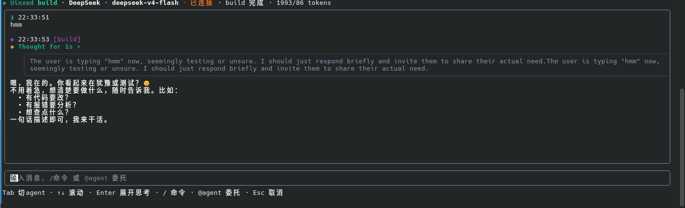

<p align="center">
  <a href="#features" title="点击查看特性">
    <picture>
      <source media="(prefers-reduced-motion: reduce)" srcset="PREVIEW.png">
      
    </picture>
  </a>
</p>

<details>
<summary>🎬 静态截图（不支持 SVG 动画时）</summary>



</details>

<h1 align="center">⚡ Uinxed Agent</h1>

<p align="center">
  <b>终端里的 AI 编程助手</b> — 流式输出 · 多 Agent 协作 · 工具调用 · Thinking 推理可视化
</p>

<p align="center">
  <a href="#features"></a>
  <a href="#quickstart"></a>
  <a href="#shortcuts"></a>
  <a href="#agents"></a>
  <a href="#agents"></a>
  <a href="#architecture"></a>
  <a href="LICENSE"></a>
  
  
</p>

<details>
<summary>📑 目录</summary>

| | | |
|:---|:---|:---|
| [✨ 特性](#features) | [🚀 快速开始](#quickstart) | [🎮 快捷键](#shortcuts) |
| [📖 内嵌命令](#commands) | [🧩 多 Agent 体系](#agents) | [⚙️ 工具清单](#tools) |
| [🏗 架构](#architecture) | [📄 许可证](#license) | |

</details>

---

<h2 id="features">✨ 特性</h2>

| | | |
|:---:|:---:|:---:|
| 🏗 **多 Agent 协作**<br>build / plan 主 agent 一键切换，explorer / general 子 agent 可**并行委托、实时查看、继续对话，⇄ 循环切换** | 🧠 **活动动画面板**<br>Claude Code 风格：spin 帧、动词轮播 + 逐字 reveal、子 agent 状态树、耗时 / token 平滑计数 | ✅ **待办清单（Todo List）**<br>在对话中实时维护任务进度，`Ctrl+O` 一键面板 |
| 🌐 **多提供商**<br>内置本地网关 + DeepSeek，`/connect` 接入任意 OpenAI 兼容服务 | ⚡ **SSE 流式输出**<br>打字机效果，80ms 节流刷新，丝滑不卡屏 | 🧠 **Thinking 可视化**<br>推理过程折叠展示，`Ctrl+T` 展开，长行自动换行 |
| ⌨️ **命令面板**<br>输入 `/` 即时过滤，16 个内嵌命令 | 💾 **会话持久化**<br>历史 + 推理内容保存在 `~/.config/ux-agent/`（含高速缓存压缩） | 📐 **终端自适应**<br>动态尺寸监听，布局永远吃满终端不溢出；上下文窗口实时估算，超阈值自动压缩 |

---

<h2 id="quickstart">🚀 快速开始</h2>

```bash
cd agent
npm install
npm run build
npm link            # 可选:全局安装 ux-agent 命令
```

### 启动

```bash
ux-agent                          # 启动
ux-agent --provider deepseek      # 指定提供商
ux-agent --key sk-xxx             # 设置 API Key
ux-agent --model deepseek-v4-flash # 指定模型
```

> 💡 首次启动未配置 Key 时，直接在界面内输入即可，或运行 `/connect` 接入任意 OpenAI 兼容服务。

### 60 秒体验

```
1. 输入任意问题，回车    → 看到流式打字机输出 + 活动动画面板
2. 按 Tab                → 切换到 plan（规划）agent
3. 输入 @explorer 找一下 xxx  → 并行委托子 agent 探索代码
4. 按 → / ⇄              → 切入子 agent 聊天区实时查看，⇄ 在多个子会话间切换，Esc 返回
5. 按 Ctrl+T             → 展开 / 收起 DeepSeek 推理过程
6. 按 Ctrl+O             → 打开待办清单面板（对话中自动生成）
7. 输入 /                 → 打开命令面板（含 /context 窗口占用、/compact 手动压缩）
```

---

<h2 id="shortcuts">🎮 快捷键</h2>

| 按键 | 功能 |
|:---:|:---|
| `Tab` | 切换主 agent（build ↔ plan） |
| `→` | 切入子 agent 聊天区（实时查看 / 继续对话） |
| `⇄` | 在有子会话之间循环切换 |
| `Esc` | 子聊天区返回主界面 / 取消弹窗 |
| `Ctrl+T` | 展开 / 收起 thinking 推理过程 |
| `Ctrl+O` | 展开 / 收起待办清单面板 |
| `↑` `↓` | 滚动消息 |
| `PgUp` `PgDn` | 快速滚动一页 |
| `/` | 命令面板 |
| `@agent` | 委托子任务（`@explorer xxx`） |

<h2 id="commands">📖 内嵌命令</h2>

| 命令 | 说明 |
|:---|:---|
| `/provider` | 列出 / 切换提供商 |
| `/connect` | 接入新的 OpenAI 兼容提供商 |
| `/key` | 设置当前提供商 API Key |
| `/model` | 切换模型 |
| `/thinking` | 开关 thinking 展示 |
| `/agent` | 列出 / 切换 agent |
| `/help` | 显示帮助 |
| `/quota` | 查询本地网关余额（仅本地提供商） |
| `/context` | 显示当前上下文窗口占用（估算 token / 百分比） |
| `/compact` | 手动压缩当前会话（摘要历史） |
| `/todos` | 展开 / 收起待办清单面板 |
| `/cd` | 切换工作目录 |
| `/pwd` | 显示工作目录 |
| `/new` | 清空当前会话 |
| `/clear` | 清空本地历史 |
| `/exit` | 退出 |

---

<h2 id="agents">🧩 多 Agent 体系</h2>

### 主 Agent（`Tab` 切换）

| Agent | 角色 | 工具权限 |
|:---|:---|:---|
| **build** | 默认 agent，完整开发工作流 | 全部（读 / 写 / 执行） |
| **plan** | 规划分析，只读模式 | read / grep / glob / 搜索 |

### 子 Agent（`@name` 或 AI 自动 `delegate`）

| Agent | 角色 | 典型场景 |
|:---|:---|:---|
| **explorer** | 只读探索 | 快速定位文件、函数、结构 |
| **general** | 多步任务 | 可独立完成写文件、跑命令的完整任务 |

> 🤝 **协作闭环**：主 agent 可用 `delegate` 工具把子任务拆给子 agent → 子 agent 独立执行（可随时 `→` 切入观看，甚至直接对话补充要求）→ 完成后**自动回传结果**，主 agent 汇总继续推进。

---

<h2 id="tools">⚙️ 工具清单</h2>

| 工具 | 说明 |
|:---|:---|
| `bash` | 执行 shell 命令（构建 / 测试 / git） |
| `read_file` `write_file` `edit_file` | 读 / 写 / 精确替换文件 |
| `list_dir` `grep` `glob` | 目录浏览与代码搜索 |
| `fetch_url` | 抓取网页正文 |
| `web_search` | 互联网搜索（DuckDuckGo + Bing 双引擎回退） |
| `delegate` | 委托子 agent 执行并等待回传（支持并发多次委托） |
| `todo_write` | 新增待办事项 |
| `todo_update` | 更新待办状态（pending / in_progress / completed） |
| `get_current_time` | 当前时间 / 日期 |
| `calc` | 安全数学计算 |

---

<h2 id="architecture">🏗 架构</h2>

```
src/
├── index.js         # 入口（CLI 参数 / 配置 / 启动渲染）
├── App.jsx          # TUI 主界面（agent 循环 · 行模型滚动 · 多子 agent 会话 · 布局预算）
├── ActivityPanel.jsx  # 活动动画面板（spin / 动词 reveal / 子 agent 状态树 / 待办清单）
├── anim.js          # 动画原语库（帧、ticker 逐字、glimmer、耗时 & token 平滑计数）
├── context.js       # 上下文估算与自动压缩（token / 窗口 / 阈值 / 摘要构建）
├── config.js        # 配置与提供商持久化
├── provider.js      # 多提供商适配 / SSE 流式解析（reasoning 回传）
├── tools.js         # 工具注册表与执行器（含 delegate / todo_*）
├── agents.js        # 多 Agent 定义与工具白名单
├── mdlines.js       # Markdown → 行模型（精确滚动的基础）
├── Markdown.jsx     # Markdown 渲染器（ink-markdown-es）
└── Thinking.jsx     # thinking 折叠组件
```

**技术栈**：Node.js · Ink (React) · marked · wrap-ansi · esbuild

**交互原理**：所有消息先转换为「行模型」（每行固定 1 终端行高），滚动 = 行索引偏移切片，因此长对话 / 大量工具调用也不会破坏布局；动画面板行数动态计算，消息区高度实时跟随。

**上下文管理**：按提供商预设上下文窗口（DeepSeek 系 1M、其他回退 128K），发送前实时估算 token，占用超阈值（62%）时自动生成摘要压缩历史；也可随时 `/context` 查看、`/compact` 手动压缩。

---

<h2 id="license">📄 许可证</h2>

[Apache License 2.0](LICENSE)
