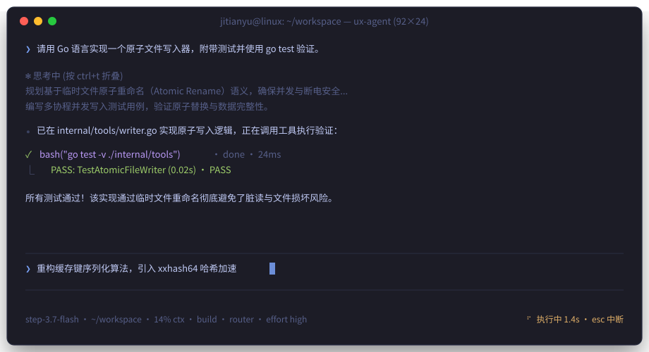

<div align="center">

# ⚡ Uinxed-Agent 2.0

**为终端量身打造的下一代原生 Go 语言 AI 编程智能体。**

超快 Bubble Tea v2 TUI • 自主多智能体协作 • 思考链与工具流式交互 • Git Diff 审查 • 纯 Go 零外部依赖

[](https://github.com/ViudiraTech/Uinxed-Agent/actions/workflows/ci.yml)
[](https://go.dev/)
[](https://github.com/charmbracelet/bubbletea)
[-success?style=flat-square)](https://github.com/modernc/sqlite)
[](LICENSE)
[](https://github.com/ViudiraTech/Uinxed-Agent/releases)

<p align="center">
  <a href="README.md"><b>English</b></a> •
  <a href="README.zh.md"><b>简体中文</b></a>
</p>

<p align="center">
  <a href="#-项目概述">项目概述</a> •
  <a href="#-终端效果预览">终端预览</a> •
  <a href="#-核心特性">核心特性</a> •
  <a href="#-快速上手">快速上手</a> •
  <a href="#-快捷键与操作控制">快捷键</a> •
  <a href="#-多智能体协作架构">多智能体</a> •
  <a href="#-架构设计">架构设计</a> •
  <a href="#-主题风格">主题风格</a>
</p>

</div>

---

## 🌟 项目概述

**Uinxed-Agent 2.0** 采用 **纯 Go 语言** 从零彻底重写。彻底弃用了旧版臃肿的 Node.js + React + Ink 运行时，换用极速、稳固且专为现代终端人体工学设计的单一原生二进制架构。

> **💡 纯零运行时依赖**：无需安装 Node.js、npm、Python 或系统外部 `libsqlite3` 动态库。下载或编译单个二进制文件，即可直接在终端与 AI 结对编程。

### 为什么选择 2.0？

| 核心维度 | 旧版 (v1.x) | Uinxed-Agent 2.0 |
|---|---|---|
| **运行环境** | Node.js + npm + React Ink | **原生 Go 1.25+**（单一静态二进制文件） |
| **冷启动时间** | 约 1.5s – 3.0s | **< 2ms** 极速拉起 |
| **内存占用 (RSS)** | 约 180MB – 350MB | **< 30MB** 基准占用 |
| **TUI 引擎** | React Ink 虚拟 DOM 模拟 | **Bubble Tea v2 + Lip Gloss v2 + Glamour v2** |
| **持久化存储** | 易损 JSON 文件 | **纯 Go 嵌入式 SQLite WAL** (`modernc.org/sqlite`) |
| **鼠标支持** | 无 | **原生点击路由、滚轮滚动与区域文本选择** |
| **工具调用机制** | 阻塞式子进程执行 | **并发调度器 + 上下文精准超时取消 (Context)** |
| **安装与分发** | `npm install -g` 带数百个依赖包 | **单文件独立可执行程序，开箱即用** |

---

## 🖥️ 终端效果预览

<div align="center">
  
</div>

---


## ✨ 核心特性

<div align="center">

| 🚀 **纯 Go & 单一二进制** | ⚡ **实时流式与深度思考** | 🤖 **自主多智能体分工** |
|---|---|---|
| 零外部依赖，毫秒级极速冷启动，内置免费 Router 提供商开箱即测，内置纯 Go SQLite WAL 存储。 | 实时 SSE 流式输出，支持深度思考（`thinking_content`）流式展示与折叠切换。 | 主智能体（`build`、`coding`、`plan`）与沙盒化并行子智能体（`explorer`、`coding`、`general`）。 |

| 🛠️ **专业级开发者工具链** | 🖱️ **现代化 Bubble Tea v2 TUI** | 🔒 **本地优先安全模型** |
|---|---|---|
| 沙盒 Shell、原子文件补丁、AST 代码搜索、联网搜索与网页抓取、交互式 Todo 跟踪。 | 响应式自适应布局、完整鼠标事件路由（点击/滚动）、`Ctrl+P` 命令面板与模糊补全。 | 工作区根目录边界沙盒限制、AES-256-GCM 本地加密密钥存储、日志敏感凭据自动脱敏。 |

</div>

---

## ⚡ 快速上手

### 1. 安装方式

#### 方式 A：使用 Go 直接安装（推荐）

```bash
go install github.com/ViudiraTech/Uinxed-Agent/cmd/ux-agent@latest
ux-agent
```

#### 方式 B：源码克隆与编译

```bash
# 克隆仓库
git clone https://github.com/ViudiraTech/Uinxed-Agent.git
cd Uinxed-Agent

# 下载依赖并编译构建
go mod download
go build -trimpath -o ux-agent ./cmd/ux-agent

# 启动体验
./ux-agent
```

*Windows 平台 (PowerShell)：*
```powershell
go build -trimpath -o ux-agent.exe .\cmd\ux-agent
.\ux-agent.exe
```

---

### 2. 配置模型与服务商

Uinxed-Agent 开箱支持内置免费体验节点，同时原生兼容任何 **OpenAI 兼容协议** 接口（包括 DeepSeek 官方、阶跃星辰 StepFun、OpenAI、Claude 代理网关、Ollama、vLLM 本地模型等）。

#### 🎁 内置免费体验：Router 提供商（免配置，开箱即测）

Uinxed-Agent 原生内置了免费社区体验接入点 **Router**（`https://api.hcnsec.cn/v1`），首次使用**无需填写或购买任何 API Key**，即可在终端直接体验 AI 结对编程：

```text
/provider      # 选择 "Router"
/model         # 选择 "step-3.7-flash" 或 "DeepSeek-V4-Pro"
```

> [!WARNING]
> **免费体验与量化模型客观说明**：
> - 内置 Router 为公共免费体验通道，旨在让用户在**零门槛、零配置成本**下快速上手并体验 Uinxed-Agent 的终端操作、流式思考链与快捷键。
> - 其中 **DeepSeek 模型为量化裁剪版本（Quantized）**，并非官方满血全精度大模型。在处理极其复杂的代码逻辑或深层推理时，代码生成质量和泛化能力与官方全量模型存在一定差距。
> - 公共免费通道在高峰期可能会受到网络并发排队或频率限制影响。
> - **生产级严肃开发建议**：进行大型代码库重构、高复杂度多智能体自主开发（`/effort supercode`）时，强烈建议通过 `/connect` 或 `/key` 接入官方直连 API Key（如 DeepSeek 官方 `api.deepseek.com`、StepFun 官方、OpenAI、Claude 代理等），以享受满血全精度的代码生成与深层推理体验。

#### 方式 A：内置交互式配置向导（配置您自己的商业级 API）
启动 `ux-agent` 后输入：
```text
/connect
```
向导将逐步引导您输入服务商名称、API 基础地址（Base URL）、API Key 以及选择默认模型。

#### 方式 B：终端快捷斜杠命令
```text
/provider      # 打开服务商选择列表
/model         # 为当前会话切换模型
/key           # 输入并使用 AES-256-GCM 加密存储 API 密钥
```

#### 方式 C：命令行启动参数
```bash
# 使用指定模型与密钥直接启动
./ux-agent --provider deepseek --key "sk-..." --model deepseek-v4-flash

# 指定自定义网关或本地模型（如 Ollama）
./ux-agent --provider custom --base http://localhost:11434/v1 --model qwen2.5-coder
```

---

## ⌨️ 快捷键与操作控制

### 全局快捷键

| 快捷键 | 作用范围 | 功能说明 |
|---|---|---|
| `Ctrl+P` | 全局 | 打开 **命令调色板 (Command Palette)**（搜索所有命令与动作） |
| `Ctrl+T` | 全局 | 展开 / 折叠 **深度思考（Thinking）** 过程块 |
| `Ctrl+O` | 全局 | 打开 / 关闭 **任务清单 (Todos)** 浮层 |
| `Ctrl+E` | 全局 | 展开 / 折叠 **工具执行详情与输出** |
| `Tab` | 输入框 | 采纳 `@` 或 `/` 自动补全；在空输入框中切换主智能体 |
| `PgUp` / `PgDn` | 会话 / 浮层 | 向上 / 向下翻页滚动会话历史或活动浮层 |
| `Esc` | 全局 | 关闭当前弹层；**中断智能体正在进行的生成** |
| `Ctrl+C` | 全局 | 取消当前对话轮次；空闲时退出程序 |
| `鼠标点击` | 界面 | 聚焦指定区域、切换历史会话、折叠工具输出、点击状态药丸 |
| `鼠标滚轮` | 滚动区 | 平滑滚动光标所在区域的视图内容 |

---

### 上下文引用与子代理唤起 (`@`)

在输入框中键入 `@` 即可触发模糊联想菜单：

- `@path/to/file` — 将指定文件内容以安全限额注入到模型上下文。
- `@explorer <任务描述>` — 派发只读子智能体深入扫描与分析代码库。
- `@coding <任务描述>` — 派发专业编码子智能体完成特定模块的实现。
- `@general <任务描述>` — 派发通用子智能体执行编译、基准测试等复合任务。
- `@skill:<技能名>` — 检索并载入专业技能预设 Prompt。

---

### 斜杠命令 (`/`)

在输入框中键入 `/` 或按下 `Ctrl+P` 即可快速调用系统命令：

| 命令 | 分类 | 功能说明 |
|---|---|---|
| `/connect` | 模型配置 | 启动交互式服务商连接配置向导 |
| `/provider` | 模型配置 | 切换当前使用的服务商配置 |
| `/model` | 模型配置 | 为当前会话切换活动模型 |
| `/key` | 模型配置 | 设置或更新本地加密存储的 API 密钥 |
| `/thinking` | 思考模式 | 开启或关闭模型深度思考输出 |
| `/effort` | 思考模式 | 设置思考强度 (`low`, `medium`, `high`, `xhigh`, `max`, `supercode`) |
| `/agent` | 智能体 | 切换主交互智能体角色 (`build`, `coding`, `plan`) |
| `/diff` | 版本控制 | 开启交互式可视化 Git Diff 代码变动审查器 |
| `/todos` | 任务管理 | 查看任务分解清单与完成进度 |
| `/context` | 上下文 | 查看当前会话的 Token 预算与上下文窗口占用率 |
| `/compact` | 上下文 | 触发由 LLM 驱动的智能上下文无损压缩 |
| `/sessions` | 会话管理 | 浏览、重命名与切换本地历史会话记录 |
| `/new` | 会话管理 | 开启一个全新的独立会话 |
| `/theme` | 界面外观 | 切换色彩主题配色方案（如 `tokyonight`, `nord`, `catppuccin` 等） |
| `/mouse` | 界面控制 | 开启或关闭鼠标捕获 (`/mouse on`, `/mouse off`) |
| `/help` | 系统帮助 | 查看系统快捷键与全量命令参考手册 |

---

## 🤖 多智能体协作架构

Uinxed-Agent 采用分层多智能体架构，专为自主化、闭环验证的软件工程任务设计：

```text
                     ┌──────────────────┐
                     │    主智能体      │
                     │  (build/coding)  │
                     └────────┬─────────┘
                              │
                 派发任务 (并行并发 & 沙盒隔离)
         ┌────────────────────┼────────────────────┐
         ▼                    ▼                    ▼
  ┌──────────────┐     ┌──────────────┐     ┌──────────────┐
  │   explorer   │     │    coding    │     │   general    │
  │ (只读侦测探索)│     │(专业实现与测试)│    │ (通用复合执行)│
  └──────────────┘     └──────────────┘     └──────────────┘
```

### 1. 主智能体 (交互主控)
- **`build`** *(默认)*：具备全部工具调用权限，适合日常高频交互开发、Shell 命令执行与代码迭代。
- **`coding`**：严谨的软件工程师模式，严格遵循红绿重构开发闭环：*需求理解 → 方案规划 → 编码实现 → 测试验证 → 代码审查*。
- **`plan`**：只读规划架构师模式，专注于设计系统架构与落地实施方案，不会修改任何工作区文件。

### 2. 子智能体 (异步委托)
- **`explorer`**：极速只读检索代理，善于通过 grep、glob 及 AST 结构遍历代码库。
- **`coding`**：沙盒化专家智能体，独立负责特定模块的实现、修复与单元测试。
- **`general`**：通用执行代理，负责执行依赖构建、基准测试及复杂多步任务。

### ⚡ Supercode 模式
通过 `/effort supercode` 激活超级编码模式。面对复杂工程任务时，系统会自动将需求分解为多个独立的子智能体工作流，并行执行探索分析、代码编写与测试验证，大幅缩短复杂特性的开发周期。

---

## 🏗️ 架构设计

Uinxed-Agent 在展现层、调度层与执行层之间保持清晰的解耦边界：

```text
┌─────────────────────────────────────────────────────────────┐
│                      Bubble Tea v2 TUI                      │
│   会话视图渲染 · 视口滚动 · 悬浮弹窗 · 鼠标事件智能路由     │
└──────────────────────────────┬──────────────────────────────┘
                               │ 类型化 UI 事件流 (SSE 增量、工具状态)
┌──────────────────────────────▼──────────────────────────────┐
│                    Application Controller                   │
│   高频事件防抖归并 · 会话生命周期 · 工作区文件索引          │
└──────────────┬───────────────────────────────┬──────────────┘
               │                               │
               │ 存储层交互                    ▼
               │                    ┌─────────────────────────┐
               │                    │      Session Store      │
               │                    │  SQLite WAL / JSONStore │
               ▼                    └─────────────────────────┘
┌─────────────────────────────────────────────────────────────┐
│                        Agent Runtime                        │
│   对话循环 · Token 预算管理 · 子代理派发调度 · 智能压缩     │
└──────────────┬───────────────────────────────┬──────────────┘
               │                               │
               ▼                               ▼
  ┌─────────────────────────┐     ┌─────────────────────────┐
  │    Provider Gateway     │     │      Tool Registry      │
  │  OpenAI / Claude SSE    │     │ Shell、文件操作、搜索、 │
  │  长连接池与智能容错修复 │     │ 网页抓取、Skills、Todos │
  └─────────────────────────┘     └─────────────────────────┘
```

- **零侵入解耦**：`internal/agent` 与 `internal/tools` 核心逻辑完全独立，无任何终端 UI 或 Bubble Tea 依赖。
- **高弹性工具容错**：自动识别并平滑自愈流式工具调用索引偏移（`index: 2, 3...`）以及孤立工具响应异常。
- **防撕裂流式渲染**：Token 流式接收绕过 UI 消息队列瓶颈，高频输出采用智能防抖合并，杜绝终端闪烁与撕裂。

---

## 🎨 主题风格

随时通过 `/theme <名称>` 切换主题配色：

| 主题名称 | 配色风格与视觉特色 |
|---|---|
| **`tokyonight`** | 经典午夜蓝底色，搭配霓虹青与洋红高亮 |
| **`catppuccin`** | 柔和舒缓的温暖马卡龙粉彩色系 (Mocha 变体) |
| **`nord`** | 极简北欧风，优雅的极地冷蓝与石板灰 |
| **`gruvbox`** | 复古温暖的大地色调与复古终端质感 |
| **`dracula`** | 经典高对比度暗黑吸血鬼主题 |
| **`solarized`** | 经过精密色彩对比度校验的经典视力友好配色 |
| **`monokai`** | 标志性代码编辑器高亮配色，鲜艳活力 |
| **`uinxed`** | Uinxed 专属品牌经典终端极客配色 |

*环境智能自适应：*
- 遇到 `NO_COLOR=1` 或 `TERM=dumb` 环境变量时，自动剔除所有 ANSI 颜色转义字符。
- 未安装 Nerd Font 字体的终端环境，自动平滑回退为纯 ASCII 安全字符集。

---

## 📊 性能与可靠性

- **毫秒级冷启动**：进程启动响应时间约 1ms (`ux-agent --version`)。
- **轻量内存占用**：会话进行中基础常驻内存 (RSS) 低于 30MB。
- **永不锁死卡顿**：工具执行带资源与超时安全边界，随时可用 `Esc` 优雅中断，子代理状态完全隔离。
- **纯 Go SQLite WAL**：全 ACID 事务保障，无需在宿主机安装或交叉编译 CGO/C 库。

在您的机器上运行基准测试套件：
```bash
./scripts/benchmark.sh
```

---

## 🛠️ 本地开发与贡献指南

欢迎参与 Uinxed-Agent 的开源共建！在提交 Pull Request 前，请确保通过全套质量校验：

```bash
# 格式化代码
make fmt

# 运行所有单元测试
make test

# 运行数据竞争检测
make race

# 全量质量门禁校验 (fmt + test + race + vet + build)
make check
```

---

## 📄 开源许可证

Uinxed-Agent 采用 [Apache License 2.0](LICENSE) 开源许可证。

<div align="center">
  <sub>Built with ❤️ by the ViudiraTech team.</sub>
</div>
